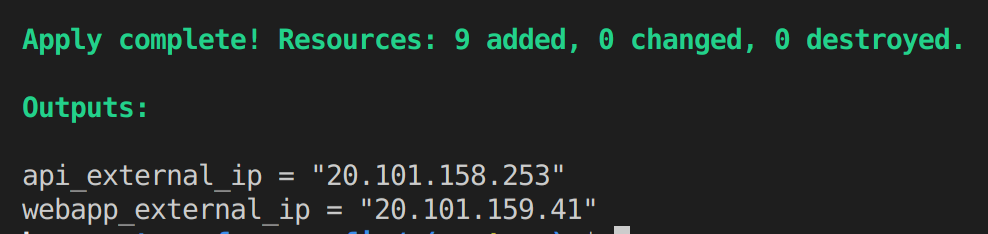
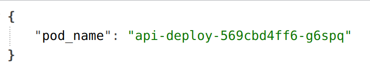
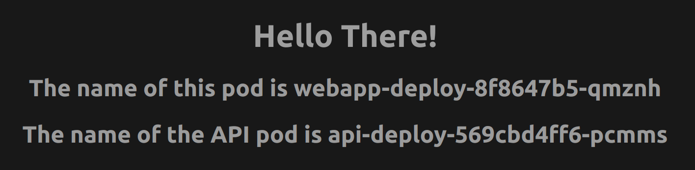
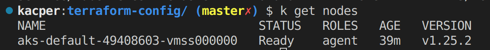
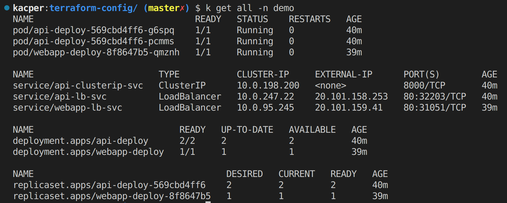
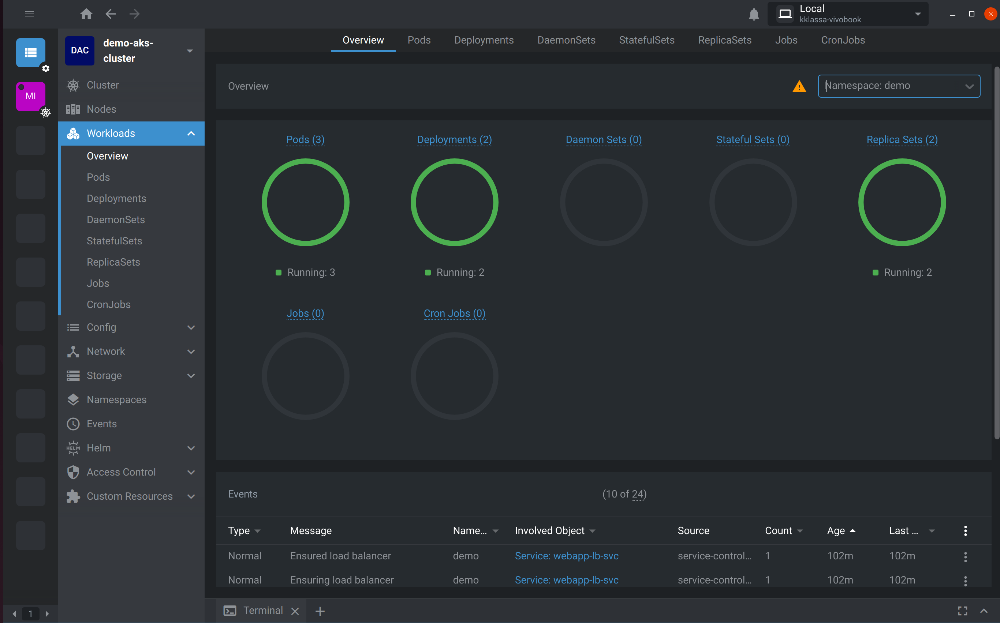

# AKS and Terraform demo

This demo aims to show you how to deploy a web application consisting of two connected components - an API and a frontend consuming it. Although the example is very simple, it showcases many important concepts about Terraform, Kubernetes and Azure.

# Introduction

Let's start by quickly introducing important concepts about the technologies we well use in this demo. 

## What is Kubernetes

Kubernetes is an open-source container orchestration tool. It contains many useful functionalities like monitoring, self-healing and rollbacks out of the box. It has become a de facto industry standard for running containerized multi-component applications in the cloud.

## What is AKS

AKS is Microsoft Azure's service for deploying Kubernetes clusters in the cloud quickly and relatively easily. It is a PaaS offering, so Azure takes care of many underlying ininfrastructure tasks, such as provisioning and scaling the virtual machines, which lets the developer focus on the actual application development.

## What is Terraform 

Terraform is an agentless Infrastructure as Code tool. It uses providers to communicate with cloud platforms in order to declaratively provision desired cloud infastructure. The infrastructure is defined by specifying resources in a declarative manner. Terraform manages the resources via the Terraforms state - it compares the real world state to the declared state and if it detects any differences, it tries to make the real world state identical to the desired one. It is also idempotent - running the same configuration twice will only affect the resources that need to be changed. Using Terraform is better than provisiong cloud infrastucture through cloud provider's user console or the CLI for several reasons - it minimizes the chance of human error which can happen while configuring the resources manually, makes the configurations more reusable and makes it possible to store the configuration in version control systems.

# Prerequisites

If you'd like to follow this demo, you need:

- Microsoft Azure account with a valid subscription
- Azure CLI
- Terraform
- (optional) kubectl - the Kubernetes command line tool
- (optional) Lens, Rancher Desktop or another app for Kubernetes cluster monitoring

# What we're going to build

The demo application constists of two components - an API and a web frontend. To better illustrate that the integration of components, each of them has a way of displaying on which Pod it is located. The API has a single endpoint, which returns the name of the Pod on which it is deployed, and the frontend displays it's own Pod name as well as makes a request to the API in order to dispay the API's Pod name, thus recreating a common pattern of backend - frontend connection. The source code and Doockerfiles of both components are located in the `demo-apps` directory of this repository.

# Terraform configuration

All the Terraform files are located in the `terraform-config` directory. Let's go over each of them in detail.

> IMPORTANT: In Terraform names of `.tf` files are not important - when you run `terraform apply` in a directory Terraform collects all `.tf` files from that directory into one. It is a good practice to make the configuration more readable by splitting the configuration into multiple files and naming them accordingly - we are going to use standard file names adapted by the community. 

## providers.tf

This file contains the configuration for providers we will need in this project. A provider is a plugin that Terraform uses in order to create and interact with resources from a particular group or cloud provider. We are going to need two providers - `azurerm` for provisioning Azure infrastructure and `kubernetes` for deploying Kubernetes objects on it. We are going to define those in the `terraform` block.

> NOTE: We could also get rid of the `kubernetes` providers and deploy Kubernetes objects to our AKS cluster by connecting to it from our local machine and usining `kubectl` to apply standard Kubernetes yaml manifests to it, but using Terraform to manage both infrastructure and the workload deployed on it makes the workflow more seamless and allows us to fully take advantage of IaC.

It is a good practice to lock the versions of required providers, in case a new release in the future introduces some breaking changes that could affect out configuration in the future. The snippet

```
kubernetes = {
  source  = "hashicorp/kubernetes"
  version = "~>2.16.0"
}
```

tells Terraform that we want to have a version of `kubernetes` provider that is equal to 2.16.0 or has a higher patch version, but the major and minor are locked to 2 and 16 respectively.

We can further configure our providers in the `provider` blocks - in our case the `azurerm` provider needs no further configuration, but we need to tell the `kubernetes` provider on which cluster it should operate, and we do that by accessing attributes of the `azurerm_kubernetes_cluster` resource which we are going to describe in the next section.

## main.tf

This file will contain the most vital part of our configuration - the resources we want to deploy. Let's go over each of them from top to bottom.

### azurerm_resource_group.demo_aks_group

This resource specifies the Azure Resource Group that our cluster will belong to. Resource Group is required by Azure in order to use most of the service that the platofrm offers, since it makes managing resources easier by grouping them in a logical, project-based manner.

### azurerm_kubernetes_cluster.demo_aks_cluster

This resource represents our Azure Kubernetes Service cluster. Although it is a single Terraform resopurce, it in fact creates many Azure resources needed by the cluster to our Azure account. We can take a look at them from our Azure account console.

### kubernetes_namespace.demo_ns

This is the first resource related directly to the `kubernetes` provider. It creates a namespace to which all other Kubernetes objects created in this demo are going to belong to. Namespaces in Kubernetes allow us to logically group our objects, which makes working with them more manageable as our cluster scales up. 

### kuberentes_deployment.demo_api_deploy

Deployment is a Kubernetes object that manages Pods with a particular configuration. Deploying  Pods via a Deployment rather than individual Pod objects is a good practice, because of the utility that the Deployment provides - it allows us to specify how many copies of a particular Pod we need, which makes it ideal for scaling up or down with the demand, as well as provides a safety mechanism with rollbacks that allow us to quickly and seamlessly come back to past Pod configurations.  
This particular Deployment created the Pods that will serve as the API - the container image and
the number of desired replicas is specified via Terraform vatriables. If our container needs to allow ingress connections, it is very important to expose the right port - in this case we need to expose the port 8000.

### kubernetes_service.demo_api_clusterip_svc

When Kubernetes Pods are created, they are assigned a local address from the cluster's address space. This introducers a few problems - if a particular Pod dies, it gets recreated with a different ip address, and if there are many Pods with the same container running on them, how do configure other Pods that need to talk to them? Kubernetes Service comes to the rescue. A Service groups a particular type of Pods and provides a single ip address unrealated to the underlying Pods' lifetimes from which they can be reached by other objects. It can also act as a load balancer by distributing the requests to different Pods. This particular resource creates a Service of type ClusterIP - such Services are only accessible by other Pods in the cluster since they share the same address space. There are two paricularly important nested blocks in every Service resource:

```
selector = {
  app       = "demo"
  tier      = "backend"
  component = "api"
}
```

The selector tells Kubernetes which Pods should be associated with the particular Service. In our case, these need to exactly match the labels defined in the `metadata` block inside the `template` block in the API Deployment we defined above.

```
port {
  port        = 8000
  target_port = 8000
}
```

Port mapping is equally important - selector tell the Service which Pods it should redirect the traffic to, but it also needs to know which ports to use. The `target_port` is the port exposed by the Pod and in this case it **must**, and the `port` will be the port that will need to be specified along with the Service ip in order to access it - it can be virtually any port, but we are going to stick to 8000 for clarity.  

> NOTE: We are not going to make a practical use of this ClusterIP service in this demo - since it is only accessible form inside the cluster, in order for out frontend Pod to be able to access it it would need to make the requests to the API on the server, and configuring Server Side Rendering in a Vue.js app is a complex task that is beyond the scope of this simple demo.

### kubernetes_service.demo_api_lb_svc

This resource is *almost* identical to the previous one - except for one line

```
type = "LoadBalancer"
```

LoadBalancer is another type of a Kubernetes Service that is specifically designed to act as, well, a load balancer. It is particularly useful when using a managed Kubernetes service like AKS, because when we mark a Service as LoadBalancer Azure will automatically assign it a public external ip address which we can access from the internet. We also changed the port of this Service to 80, which makes it possible to connect to the Service without specifing the port since port 80 is default for HTTP.

> NOTE: We will use this LoadBalancer Service external ip in order to make requests to the api from out frontend.

### kubernetes_deployment.demo_webapp_deploy

This resource is the definition of the Kubernetes Deployment that will manage our frontend Pods. It is very simillar to the previous one, there a few exceptions though - we need to use a different container image and expose a different port. We also need to pass the API's external ip address to the Pod as en environment variable - this can be done inside of the `env` block by specifing a name and value pair. For the value we use a local variable constructed with the attributes exported by the `demo_api_lb_svc` resource.

### kubernetes_service.kubernetes_service

Our last `kubernetes` resource is a LoadBalancer Service for the frontend, since we want to be able to access it from our browser.

## variables.tf

In this file we define the variables that are needed to make our configuratuion more flexible and readable.

## locals.tf

We use this file to construct local variables that we need in our configuration, but we don't know the value for beforehand.

## outputs.tf

In this file we define values that should be outputted to the user after a successful appy. We out case we included the external ip of the webapp LoadBalancer Service and a local file that will contain the most importatant data about the cluster - the *kubeconfig*. We can use this file to connect to the deployed cluster from our local machine with kubectl or to configure Lens.

# Applying the configuration

First, since we are using Azure, we need to login to our Azure account

```
az login
```

This will open the browser where we'll need to login to our Azure account. If all goes well, we should be able to access azure from the command line and use the `azurerm` provider in Terraform.

All we need to do now to apply our configuration is to change into the directory that contains it

```
cd terraform-config
```

And run the command

```
terraform apply
```

This will generate a *plan* that helps us check if our configuration matches what we had in mind. We can confirm the apply by typing `yes`.
After applying, we will need to wait for about 5 to 10 minutes for the infrastructure creation to complete.

# Testing the configuration

After some time we should see a similar output in the console:




## Accessing the demo application components

Let's check if everything works fine by opening the outputted ips in the browser:



The API Service is accessible and shows us the name of the Pod from which we received the data.



We were also albe to access the webapp Service and see the Pod that it's connected to. We can also see that the name of the API Pod to which our frontend sent a request is different - that shows that the LoadBalancer is doing it's job by redirecting the traffic to different pods.

## Connecting to the cluster

We can also connect to our cluster to take a look at all deployed resources.

### Connecting with kubectl

In order to configure kubectl to work with our AKS cluster we need to export a special environemt variable:

```
export KUBECONFIG="./kubeconfig"
```

We can check that we are now connected to the remote AKS cluster by running

```
kubectl get nodes
```

Which should give us a similar output:



We can also check that all objects are present in the `demo` namespace:



### Connecting with Lens

For more insights and a user-friendly graphical interface we can connect to the cluser using Lens. For that we need to copy the contents of the `kubeconfig` file created by Terraform and add it to Lens by clicking the hamburgher menu button in the top left corner and going to File >
Add Cluster and pasting the `kubeconfig`. In the *Workloads* section we can take a look at what is deployed on the cluster.



# Clean up

To clean up we just need to run one terraform command:

```
terraform destroy -auto-approve
```

This will get rid of all resources - first it will destroy the Kubernetes objects and then the AKS infrastucture.

*This project was created as a an assignment from System Design and Integration course at Warsaw University of Technology*
